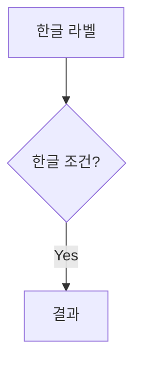

# 마크다운 작성 가이드

## 볼드(`**`) 작성 시 주의사항

`marked.js` 라이브러리에서 **따옴표(`"`)가 `**` 바깥에 있을 때** 볼드가 정상적으로 렌더링되지 않습니다.

### ❌ 잘못된 방식
```markdown
**"모바일웹으로 해결되지 않는 과제를 앱이 얼마나 명확히 해결하는가"**
```

### ✅ 올바른 방식
```markdown
"**모바일웹으로 해결되지 않는 과제를 앱이 얼마나 명확히 해결하는가**"
```
→ 따옴표를 `**` 바깥쪽으로 배치하면 정상적으로 **볼드** 처리됩니다.

---

## 볼드(`**`) 작성 시 주의사항 - 2

### 긴 문장을 하나로 볼드 처리하지 않기
특수문자(`·`, `/`, `(`, `)` 등)가 많은 긴 문장을 하나의 `**`로 감싸면 파싱에 실패합니다.

#### ❌ 잘못된 예
```markdown
**기획·디자인·개발·QA·보안·스토어 배포·운영대응 인월(M/M)**
```

#### ✅ 올바른 예
```markdown
**기획**·**디자인**·**개발**·**QA**·**보안**·**스토어 배포**·**운영대응 인월**(M/M)
```
→ 각 단어를 개별 볼드로 처리하고 중간점은 볼드 밖에 둡니다.

---

## Mermaid 다이어그램 작성 시 주의사항

### ✅ 정상

- 노드 라벨은 `""`로 감싸기
- 화살표 라벨도 `""`로 감싸기
