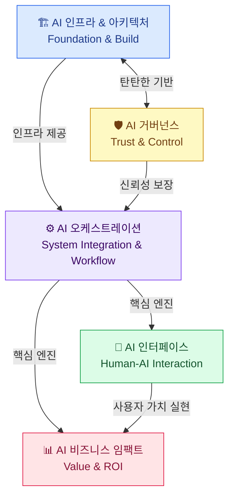

AI 기술의 파편화된 변화를 '가치 창출'이라는 하나의 큰 흐름 속에서 체계적으로 관리하기 위한 5개 영역 프레임워크를 소개합니다.

{/* truncate */}

## 왜 프레임워크가 필요한가

AI 기술은 빠르게 변화하고 있습니다. ChatGPT, Claude, Gemini 같은 모델이 쏟아지고, RAG·에이전트·파인튜닝 같은 기법이 동시에 등장하면서 전체 그림을 보기 어려워졌습니다. 이 프레임워크는 AI 기술을 5개 레이어로 나눠 **어떤 기술이 어디에 속하는지** 명확하게 정리합니다.

---

## 5개 영역 구성

### 🏗 1. AI 인프라 & 아키텍처 (Foundation & Build)

AI 시스템이 구동되기 위한 가장 밑단의 물리적·논리적 기반입니다.

- **컴퓨팅 자원 관리**: GPU/NPU 서버, 클라우드 인프라 최적화
- **모델 선택 및 튜닝**: 목적에 맞는 LLM 선정, 파인튜닝, 양자화
- **데이터 파이프라인**: AI 학습 및 추론을 위한 실시간 데이터 수집·정제

### ⚙️ 2. AI 오케스트레이션 (System Integration & Workflow)

여러 요소 기술을 결합해 지능적인 워크플로우를 완성하는 핵심 엔진입니다.

- **프롬프트 및 컨텍스트 설계**: 고도화된 프롬프트와 RAG 기반 지식 연결
- **에이전트 인터페이스**: 외부 툴(API) 연동, 다중 에이전트 협업·실행 제어
- **프로세스 자동화**: 복잡한 비즈니스 로직을 AI가 단계별로 수행하는 워크플로우 엔진

### 🛡 3. AI 거버넌스 (Trust & Control)

AI가 기업과 사회의 기준 내에서 안전하고 일관되게 작동하도록 통제합니다.

- **가드레일 및 보안**: 유해 콘텐츠 차단, 개인정보·기업 기밀 유출 방지
- **모니터링 및 관측성**: Hallucination 체크, 지연 시간, 비용 추적
- **윤리 및 규제 준수**: AI 윤리 가이드라인 적용, AI Act 등 법규 대응

### 🤝 4. AI 인터페이스 (Human-AI Interaction)

사용자가 AI의 가치를 실제로 체감하고 상호작용하는 접점을 설계합니다.

- **UI**/**UX 디자인**: 대화형 인터페이스(CUI), 멀티모달(시각/음성) 최적화
- **AI 리터러시 교육**: 사용자가 AI를 효과적으로 활용할 수 있는 가이드·역량 강화
- **피드백 루프**: 사용자 피드백을 수집해 시스템에 반영하는 메커니즘

### 📊 5. AI 비즈니스 임팩트 (Value & ROI)

AI 도입이 실제 비즈니스 가치로 전환되는지 정량적으로 평가합니다.

- **KPI** 및 **ROI** 분석: 생산성 향상 시간, 비용 절감액, 매출 기여도 측정
- **BM 혁신**: AI를 통한 새로운 제품·서비스 개발 및 시장 진입 전략
- **스케일업 전략**: 성공적인 AI 유즈케이스를 전사적으로 확산하는 전략

---

## 영역 간 관계

- **1번**(인프라)과 **3번**(거버넌스)이 탄탄한 기반(Foundation)
- **2번**(오케스트레이션)이 핵심 엔진(Engine)
- **4번**(인터페이스)과 **5번**(비즈니스)을 통해 최종 가치(Value) 실현

이 프레임워크를 기반으로 각 영역별 실전 사례와 기술 노트를 축적해 나가겠습니다.
