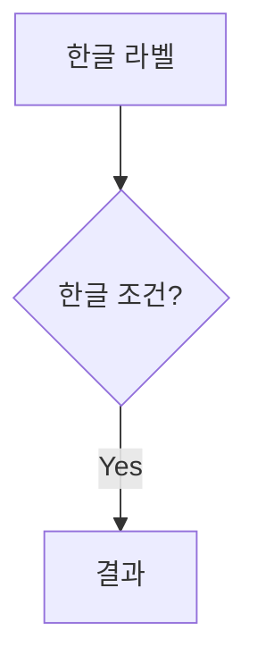

AI 콘텐츠를 마크다운으로 작성할 때 자주 발생하는 렌더링 오류 패턴과 올바른 작성법을 정리합니다.
`marked.js` 기반 환경(Docusaurus 포함)에서 볼드(`**`)와 Mermaid 다이어그램을 안정적으로 렌더링하는 가이드입니다.

{/* truncate */}

## 볼드(`**`) — 따옴표 위치 주의

`marked.js`는 **따옴표(`"`)가 `**` 바깥에 있을 때** 볼드를 정상적으로 렌더링하지 못합니다.

### ❌ 잘못된 작성법

```markdown
**"모바일웹으로 해결되지 않는 과제를 앱이 얼마나 명확히 해결하는가"**
```

화면에 `**"..."**`가 그대로 아스키 문자로 표시됩니다.

### ✅ 올바른 작성법

```markdown
"**모바일웹으로 해결되지 않는 과제를 앱이 얼마나 명확히 해결하는가**"
```

따옴표를 `**` 바깥쪽으로 배치하면 정상적으로 **볼드** 처리됩니다.

### 요약 비교표

| ❌ 오류 | ✅ 정상 |
|---------|---------|
| `**"텍스트"**` | `"**텍스트**"` |
| `'**텍스트**'` (작은따옴표는 OK) | `'**텍스트**'` |

> **원인**: marked.js 인라인 파서가 `**"` 조합에서 `**` 토큰을 인식하지 못합니다.

---

## 볼드(`**`) — 긴 문장·특수문자 주의

특수문자(`·`, `/`, `(`, `)` 등)가 많은 긴 문장을 하나의 `**`로 감싸면 파싱에 실패합니다.

### ❌ 잘못된 예

```markdown
**기획·디자인·개발·QA·보안·스토어 배포·운영대응 인월(M/M)**
```

### ✅ 올바른 예

```markdown
**기획**·**디자인**·**개발**·**QA**·**보안**·**스토어 배포**·**운영대응 인월**(M/M)
```

각 단어를 개별 볼드로 처리하고, `·`와 `(` `)` 같은 특수문자는 볼드 밖에 둡니다.

---

## Mermaid 다이어그램 작성 시 주의사항

### ✅ 정상 작성법

```markdown

```

- 노드 라벨은 `""` 로 감싸기
- 화살표 라벨도 `""` 로 감싸기

### ❌ 흔한 오류 패턴

| 오류 상황 | 원인 |
|---|---|
| `quadrantChart`에서 축 레이블에 특수문자 미사용 | 파싱 실패 |
| `sequenceDiagram`에서 `participant` 이름이 숫자로 시작 | 파싱 실패 |
| 노드 라벨에 `()` 미감싸기 | 렌더링 불안정 |

---

## 일반 마크다운 문법 참고

### 볼드 / 이탤릭

```markdown
**볼드 텍스트**
*이탤릭 텍스트*
***볼드 이탤릭***
```

### 인용문

```markdown
> 인용문 내용
```

### 목록

```markdown
- 순서 없는 목록

1. 순서 있는 목록
```

### 제목 계층

```markdown
# H1 — 섹션 타이틀
## H2 — 부제목
### H3 — 소제목
```
