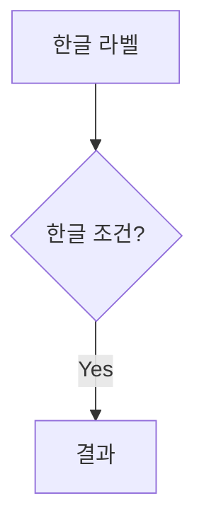

# 마크다운 작성 가이드

## 볼드(`**`) 작성 시 주의사항

`marked.js` 라이브러리에서 **따옴표(`"`)가 `**` 바깥에 있을 때** 볼드가 정상적으로 렌더링되지 않습니다.

### ❌ 잘못된 작성법

```markdown
**"모바일웹으로 해결되지 않는 과제를 앱이 얼마나 명확히 해결하는가"**
```

→ 화면에 `**"..."**` 가 그대로 아스키 문자로 표시됩니다.

### ✅ 올바른 작성법

```markdown
"**모바일웹으로 해결되지 않는 과제를 앱이 얼마나 명확히 해결하는가**"
```

→ 따옴표를 `**` 바깥쪽으로 배치하면 정상적으로 **볼드** 처리됩니다.

### 다른 예시

| ❌ 오류 | ✅ 정상 |
|---------|---------|
| `**"텍스트"**` | `"**텍스트**"` |
| `'**텍스트**'` (작은 따옴표는 OK) | `'**텍스트**'` |

> **원인**: marked.js 인라인 파서가 `**"` 조합에서 `**` 토큰을 인식하지 못합니다.

---

## 볼드(`**`) 작성 시 주의사항 - 2

### 긴 문장을 하나로 볼드 처리하지 않기

특수문자(`·`, `/`, `(`, `)` 등)가 많은 긴 문장을 하나의 `**`로 감싸면 파싱에 실패합니다.

#### ❌ 잘못된 예

```markdown
**기획·디자인·개발·QA·보안·스토어 배포·운영대응 인월(M/M)**
```

#### ✅ 올바른 예

```markdown
**기획**·**디자인**·**개발**·**QA**·**보안**·**스토어 배포**·**운영대응 인월**(M/M)
```

→ 각 단어를 개별 볼드로 처리하고 중간점은 볼드 밖에 둡니다.

---

## 일반적인 마크다운 문법

### 볼드 / 이탤릭

```markdown
**볼드 텍스트**
*이탤릭 텍스트*
***볼드 이탤릭***
```

### 인용문

```markdown
> 인용문 내용
```

### 목록

```markdown
- 순서 없는 목록
- 두 번째 항목

1. 순서 있는 목록
2. 두 번째 항목
```

### 제목

```markdown
# H1 (섹션 타이틀)
## H2 (부제목)
### H3 (소제목)
```

---

## Mermaid 다이어그램 작성 시 주의사항

### ✅ 정상



- 노드 라벨은 `""`로 감싸기
- 화살표 라벨도 `""`로 감싸기

### ❌ 오류

- `quadrantChart`에서 축 레이블에 특수문자 미사용 시 오류
- `sequenceDiagram`에서 `participant` 이름이 숫자로 시작하면 오류
