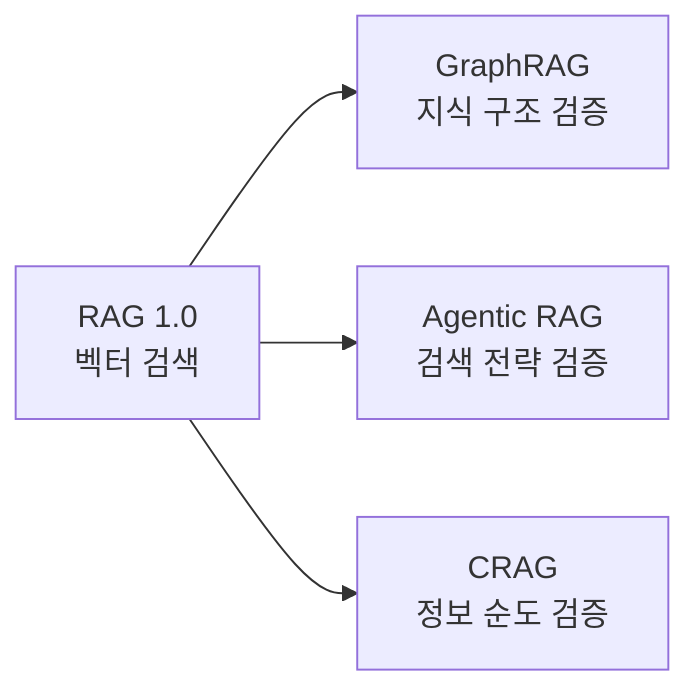
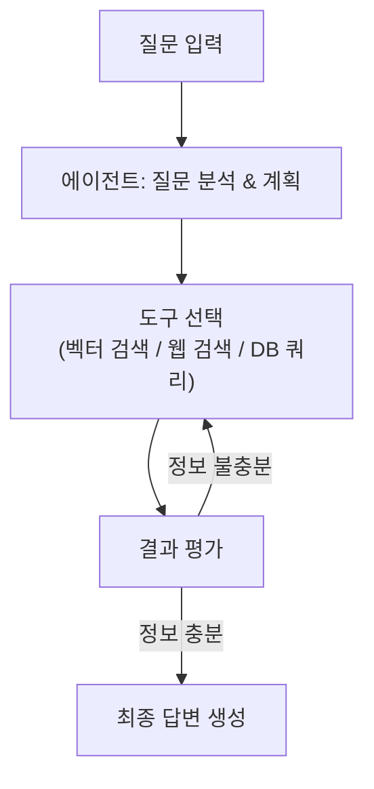
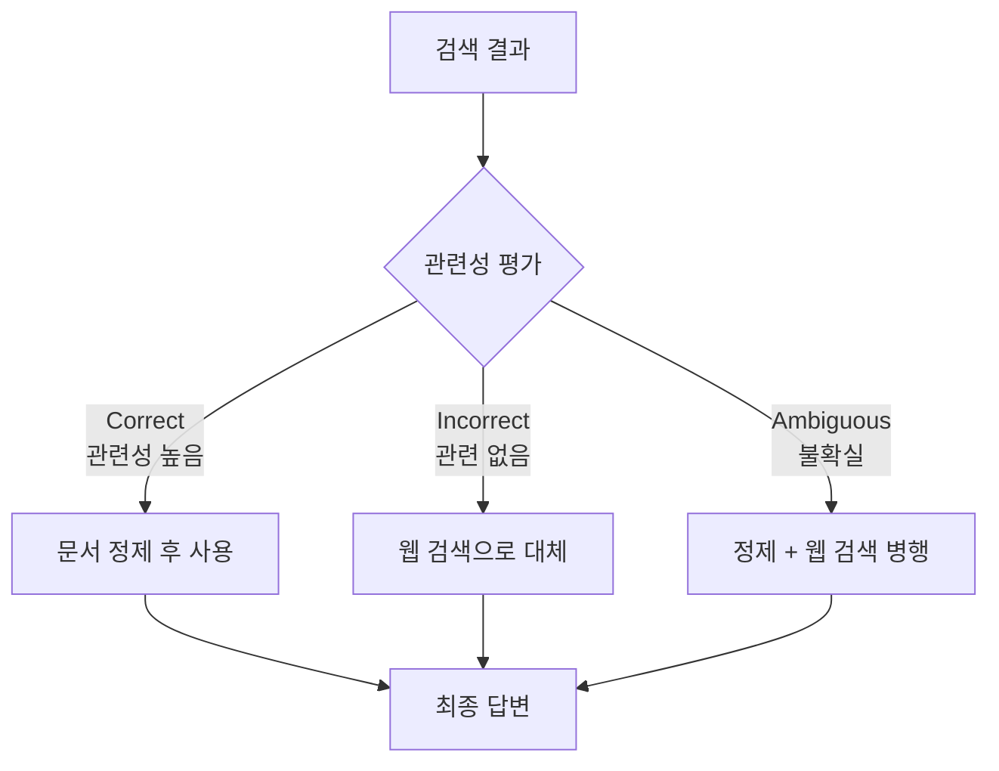

> 출처: [RAG 2.0 기술 총정리](https://blog.cslee.co.kr/rag-2-0-graphrag-agentic-rag-crag/) — 개념부터 실무 적용까지

RAG 1.0이 "검색"에 집중했다면, **RAG 2.0은 "검증"에 집중**합니다. 세 가지 접근법이 각각 다른 방식으로 검증 문제를 해결합니다.

---

## 전통적 RAG(Naive RAG)의 한계

고전적 RAG는 문서 인덱싱 → 벡터 유사도 검색 → LLM 생성의 3단계 파이프라인입니다.

| 한계 | 내용 |
|---|---|
| **검색 품질** | 벡터 유사도만으로는 실제 맥락 관련성 판단 불가 |
| **글로벌 질문** | "이 데이터셋의 주요 주제는?"에 답하지 못함 |
| **연결 관계** | 여러 문서를 엮어야 하는 복잡한 질문에 취약 |
| **자기 검증 부재** | 검색된 문서가 실제 관련 있는지 스스로 판단 못함 |

---

## RAG 2.0 세 가지 접근법

---

## 1. GraphRAG — 지식 그래프 기반 검색

마이크로소프트가 2024년 발표·오픈소스화한 방식으로, 문서를 벡터가 아닌 **지식 그래프**로 인덱싱합니다.

### 인덱싱 단계

1. 문서를 TextUnit으로 분할
2. LLM으로 **개체(Entity)** · **관계(Relationship)** · **클레임** 추출
3. 지식 그래프 구조화
4. 그래프 알고리즘으로 **커뮤니티(밀접한 개체 집합)** 클러스터링
5. 각 커뮤니티 LLM 요약문 생성

### 쿼리 단계 — 2가지 검색 방식

| 방식 | 대상 질문 | 예시 |
|---|---|---|
| **로컬 검색** | 특정 개체 관련 | "서울시가 발주한 정책 현안 관련 사업은?" |
| **글로벌 검색** | 전체 데이터셋 관련 | "우리 부서 입찰 사업들의 주요 트렌드는?" |

### 성능 및 실무 고려사항

- **포괄성**: 전통적 RAG 대비 70~80% 승률 (마이크로소프트 벤치마크)
- **높은 인덱싱 비용**: 모든 문서에 LLM을 여러 번 호출 → API 비용 주의
- **도메인 튜닝 필요**: 개체·관계 추출 프롬프트를 도메인에 맞게 조정
- **GraphRAG 1.0** (2024.12): LanceDB·Azure AI Search 벡터 스토어 통합

---

## 2. Agentic RAG — 동적으로 사고하는 검색

AI 에이전트를 RAG 파이프라인에 통합해 **검색 전략을 동적으로 수립·실행**합니다.

### ReAct 프레임워크 작동 흐름

### 실무 예시 — 신규 발주 사업 검토

1. **벡터 DB 검색** → 유사 과거 사업 5건 발견
2. **그래프 검색** → 경쟁사 수주 현황 확인
3. **자동 판단** → "경쟁사 A가 서울시 사업 2건 수주, 전략 재검토 필요"

### 주요 특징

- **다중 데이터 소스**: 벡터 DB·RDB·웹 검색·API를 상황에 맞게 선택
- **쿼리 라우팅**: 질문 유형에 따라 적절한 검색 엔진 자동 연결
- **멀티 턴**: 여러 단계 상호작용으로 점진적 정보 수집

### 구현 도구

| 도구 | 특징 |
|---|---|
| **LangGraph** | 노드·엣지 기반 워크플로우, LangChain 연동 |
| **LlamaIndex** | Agentic document workflows 내장 |
| **AutoGen** | 마이크로소프트 멀티 에이전트 프레임워크 |
| **CrewAI** | 협업 에이전트 시스템 |

---

## 3. CRAG — 자체 검증하는 검색

2024년 1월 arXiv 발표. 검색된 문서 품질을 **스스로 평가하고 교정**하는 메커니즘입니다.

### 3가지 핵심 컴포넌트

#### ① 검색 평가자 (Retrieval Evaluator)

검색된 각 문서에 관련성 점수를 부여하고 3가지 경로 중 하나를 선택합니다.

#### ② 지식 정제 (Knowledge Refinement)

- 문서를 "지식 스트립"으로 분해
- 각 조각의 관련성 재평가
- 핵심 정보만 선별

#### ③ 웹 검색 확장

- 쿼리 재작성(Query Rewriting) 후 웹 검색
- Wikipedia 등 신뢰 가능한 소스 우선 활용

### CRAG의 강점 — 모듈화

기존 RAG 파이프라인에 **평가자 레이어만 추가**하면 점진적으로 적용 가능합니다. 전면 재구축 없이 도입할 수 있는 가장 현실적인 RAG 2.0 진입점입니다.

---

## 세 기술 비교

| 구분 | **GraphRAG** | **Agentic RAG** | **CRAG** |
|---|---|---|---|
| **핵심 혁신** | 지식 그래프 구조화 | 동적 에이전트 | 자체 검증 |
| **검증 대상** | 지식의 구조 | 검색의 적절성 | 정보의 순도 |
| **강점** | 복잡한 관계·글로벌 질문 | 유연한 다중 소스 | 단순·모듈화 |
| **약점** | 높은 비용·느린 인덱싱 | 복잡성·디버깅 어려움 | 평가자 정확성 의존 |
| **도입 난이도** | 높음 | 중간~높음 | 낮음 |

---

## 잔존 과제

- **비용**: 품질 향상 = LLM 호출 증가 → API 비용·응답속도 트레이드오프
- **설명 가능성**: 복잡한 파이프라인일수록 "왜 이 답이 나왔는지" 추적 어려움
- **평가 기준**: "좋은 답변" 정의 자체가 도메인마다 다름
- **도메인 특화**: 범용 설정은 없음, 항상 튜닝 필요

---

## 향후 발전 방향

- **LazyGraphRAG**: 비용을 줄인 경량 그래프 구축
- **멀티모달 RAG**: 텍스트·이미지·표·차트 통합 처리
- **에이전트 협업**: 특화 에이전트 여러 개가 역할 분담
- **설명 가능성(XAI)**: 답변 생성 과정 추적 가능한 시스템

---

## 관련 카테고리

- [🏗 인프라 & 아키텍처](/ai-tech/인프라/overview) — 벡터 DB, LLM API 제공자 선택
- [🛡 AI 거버넌스](/ai-tech/거버넌스/overview) — Hallucination 모니터링, 답변 신뢰도 관리
