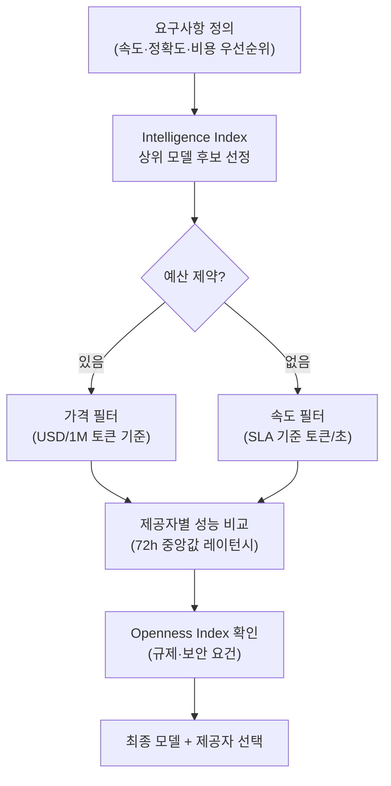

> 출처: [Artificial Analysis](https://artificialanalysis.ai/) — 독립적인 AI 모델 성능·가격·속도 분석 플랫폼

AI 인프라를 설계할 때 가장 중요한 결정 중 하나는 **어떤 모델을**, **어느 API 제공자**를 통해 사용할지 선택하는 것입니다. Artificial Analysis는 483개 이상의 모델을 독립적으로 평가해 객관적인 지표를 제공합니다.

---

## 3대 핵심 평가 지표

모든 모델을 아래 세 가지 축으로 동시에 비교합니다.

| 지표 | 설명 | 단위 |
|---|---|---|
| **지능** (Intelligence) | 추론·지식·코딩·수학 등 종합 벤치마크 점수 | 0 – 100점 |
| **속도** (Speed) | 실시간 API 호출 기준 출력 속도 | 토큰/초 |
| **가격** (Price) | 입력+출력 토큰 합산 비용 | USD / 1M 토큰 |

> **활용 팁**: 세 지표를 동시에 보면 "가성비 최적 모델"을 식별할 수 있습니다. 지능이 높고 가격이 낮은 모델이 항상 최선은 아닙니다 — 속도가 SLA에 영향을 줍니다.

---

## Intelligence Index v4.0 — 세부 벤치마크

**Artificial Analysis Intelligence Index**는 10가지 독립 태스크의 가중 평균입니다.

| 벤치마크 | 측정 영역 |
|---|---|
| **GDPval-AA** | 웹·셸 접근을 통한 실제 경제 가치 작업 수행 능력 |
| **Terminal-Bench Hard** | 터미널 환경 명령 실행·자동화 |
| **SciCode** | 과학 연구 코드 생성 |
| **AA-LCR** | 긴 컨텍스트 추론 (Long Context Reasoning) |
| **AA-Omniscience** | 지식 정확도 + 환각(Hallucination) 감지 |

### AA-Omniscience — 환각 탐지 지표

- 점수 범위: **–100 ~ +100**
- 정확한 정보 제공 시 양수, 환각 발생 시 음수
- **거버넌스 관점**에서 Hallucination 위험이 낮은 모델 선별에 활용

---

## API 제공자 성능 비교

같은 모델(예: GPT-4o)이라도 **어느 API 제공자**를 경유하느냐에 따라 속도와 가격이 달라집니다.

```
Artificial Analysis가 추적하는 주요 제공자
─────────────────────────────────────
Amazon Bedrock  │ Google Vertex  │ Groq
Together.ai     │ Fireworks      │ Azure OpenAI
Replicate       │ Perplexity     │ ... (23개)
```

### 제공자 선택 기준

- **지연 시간(Latency)**: 72시간 중앙값 기준 — 스파이크 제외한 안정성 확인
- **출력 속도**: 실시간 토큰/초 측정값
- **가격**: 입력/출력 토큰별 분리 비용 + 캐싱 할인 적용 여부

---

## 멀티미디어 AI 모델 평가

텍스트 외 모달리티도 ELO 기반 블라인드 선호도 투표로 평가합니다.

| 카테고리 | 주요 모델 |
|---|---|
| **텍스트 → 이미지** | Midjourney, DALL-E 3, Stable Diffusion, Flux |
| **이미지 편집** | Adobe Firefly, GPT-4o Vision 등 |
| **텍스트 → 비디오** | Sora, Runway Gen-3, Kling |
| **텍스트 → 음성(TTS)** | ElevenLabs, OpenAI TTS, Google TTS |

---

## Openness Index — 모델 개방성 평가

독점 모델 vs. 오픈소스 모델 선택 시 참고하는 투명성 지표입니다.

| 항목 | 설명 |
|---|---|
| **가용성** | 가중치 공개 여부, 로컬 실행 가능 여부 |
| **방법론 투명성** | 학습 방식·평가 방법 공개 수준 |
| **학습 데이터** | 데이터셋 출처·라이선스 공개 여부 |

> **거버넌스 연계**: 규제 준수(AI Act 등)에서 모델 투명성 요건이 강화되고 있어 Openness Index는 규제 대응 근거 자료로 활용 가능합니다.

---

## 인프라 설계 시 활용 방법



### 의사결정 체크리스트

- [ ] 태스크 유형 파악 — 코딩/추론/멀티모달 중 무엇인가?
- [ ] Intelligence Index에서 태스크 관련 서브벤치마크 점수 확인
- [ ] 동일 모델 제공 API 제공자 속도·가격 비교
- [ ] AA-Omniscience 점수로 환각 허용 수준 검증
- [ ] Openness Index로 내부 보안 정책·규제 준수 확인
- [ ] 72시간 성능 추이로 안정성 검증

---

## 관련 카테고리

- [🛡 AI 거버넌스 개요](/ai-tech/거버넌스/overview) — Hallucination 모니터링, 규제 준수
- [📊 AI 비즈니스 임팩트](/ai-tech/비즈니스/overview) — 모델 비용 기반 ROI 분석
