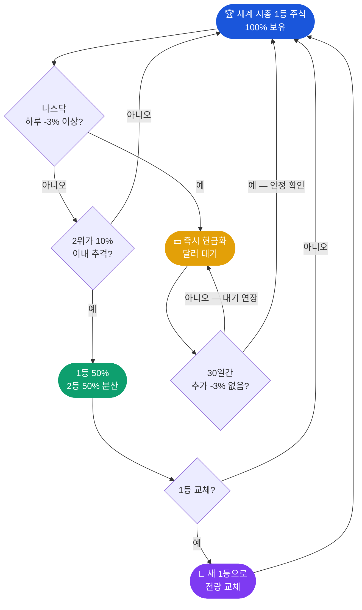

# 🏆 최고의 투자 — 일등주식투자법

:::info 출처
이 페이지는 [최고의 투자 — 일등주식투자법](https://jeonck.github.io/adv-invest/#method) 의 내용을 요약한 것입니다.
상세 내용은 하단 링크를 참고하세요.
:::

## 한 줄 정의

> **"잃지 않는 것이 먼저."**
> 세계 시총 1등 주식만 보유하고, 나스닥 -3% 법칙으로 손실을 차단하는 원칙 기반 투자법. (조던 · 김장섭)

## 투자 의사결정 흐름

## 5가지 핵심 원칙

| # | 원칙 | 내용 |
|---|------|------|
| 1 | **종목 선택** | 세계 시총 1등 주식만 100% 보유 |
| 2 | **매도 신호** | 나스닥 하루 -3% 이상 → 즉시 비중 축소 또는 전량 매도 |
| 3 | **재매수 조건** | 마지막 -3% 이후 30일간 추가 하락 없으면 재매수 |
| 4 | **단계적 헤지** | 전고점 대비 -2.5%마다 주식 10%씩 현금화 (말뚝 박기) |
| 5 | **1등 교체** | 시총 순위 역전 시 → 새 1등으로 전량 전환 |

## 시총 1등 기업 변천

| 기간 | 1등 기업 |
|------|---------|
| 2012 ~ 2023 | 애플 (AAPL) |
| 2023 ~ 2024 | 마이크로소프트 (MSFT) |
| 2024 ~ 현재 | 엔비디아 (NVDA) — 약 $4.8조 |

## 장단점 요약

| 구분 | 내용 |
|------|------|
| ✅ 장점 | 감정 배제 · 명확한 기준 · 초보자 실행 가능 · 대형 하락장 자산 보호 |
| ⚠️ 주의 | 잦은 매매 시 세금·수수료 발생 · 신호 즉시 실행 규율 필요 |

---

## 상세 자료

| 섹션 | 링크 |
|------|------|
| 📌 전략 개요 | [바로가기](https://jeonck.github.io/adv-invest/#method) |
| 🏆 1등 주식 선택법 | [바로가기](https://jeonck.github.io/adv-invest/#method) |
| 📉 나스닥 -3% 법칙 | [바로가기](https://jeonck.github.io/adv-invest/#method) |
| 🔄 리밸런싱 전략 | [바로가기](https://jeonck.github.io/adv-invest/#method) |
| 🆕 진화된 전략 | [바로가기](https://jeonck.github.io/adv-invest/#method) |

:::warning 면책사항
이 내용은 교육 목적으로 작성되었으며 투자 권유가 아닙니다. 모든 투자는 본인의 판단과 책임 하에 이루어집니다.
:::
