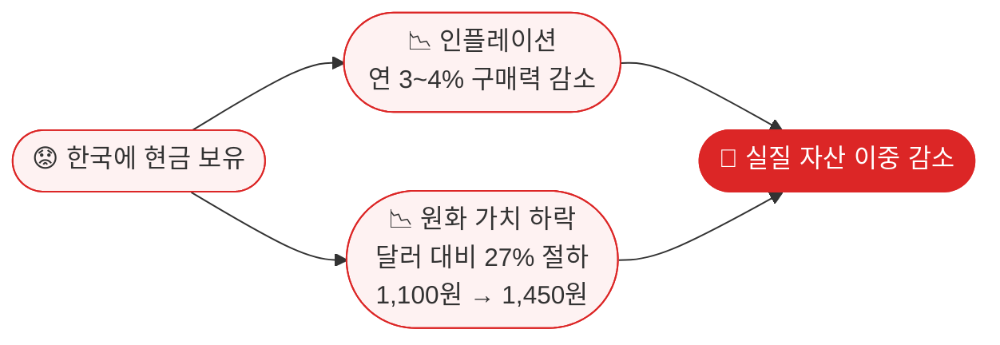
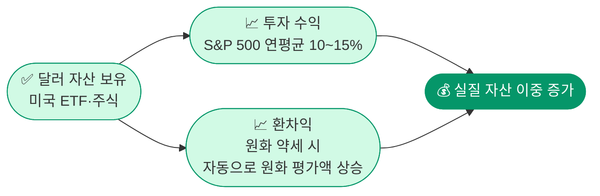
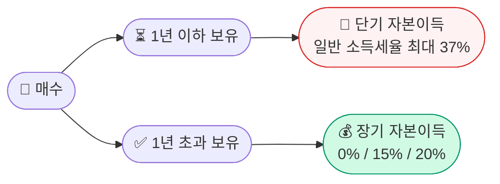
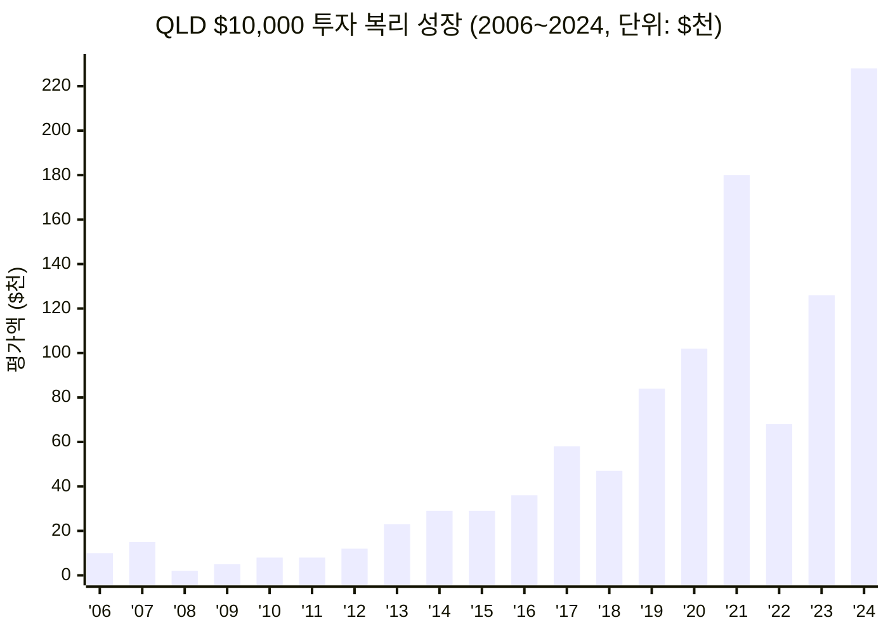
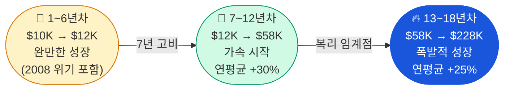

# 💹 자본이득(Capital Gains) — 미국에서 돈이 일하게 하라

> **자본이득 = 매도가 − 취득가 − 필요경비**  
> 싸게 사서 비싸게 판 차익. 핵심은 **무엇을 사느냐**와 **얼마나 오래 버티느냐**다.

---

## 🇰🇷 한국 거주 일반 국민

### 지금 가만히 있으면 손해다

| 보유 방식 | 연 수익률 | 10년 후 |
|---------|---------|--------|
| 한국 예금 | 3.5% | 인플레이션·원화 약세에 잠식 → **실질 제자리** |
| 미국 S&P 500 | 평균 10% | 원금의 **2.6배** + 달러 강세 효과 |
| 미국 나스닥 100 | 평균 15% | 원금의 **4배** + 달러 강세 효과 |

### 이중 손실 구조

### 원화 약세가 자산에 미치는 실제 영향

2020년 이후 원/달러 환율은 약 **27% 상승** (원화 가치 27% 하락).  
한국에서 원화로만 자산을 보유했다면, 달러 기준으로 그만큼 손해를 본 셈이다.

| 시점 | 환율 | 1억 원의 달러 가치 |
|------|------|-----------------|
| 2020년 초 | 1,150원/달러 | **$86,956** |
| 2022년 말 | 1,300원/달러 | **$76,923** ▼ 11.5% |
| 2025년 현재 | 1,450원/달러 | **$68,966** ▼ 20.7% |

> 아무것도 안 했는데 5년 만에 달러 기준 자산이 **약 21% 증발**한 것과 같다.

반대로 2020년에 1억 원으로 달러 자산(S&P 500 ETF)을 매수했다면:

| 항목 | 수치 |
|------|------|
| 2020년 매수 | $86,956 상당 |
| 5년간 S&P 500 수익 (연평균 15%) | × 2.0배 → **$173,913** |
| 2025년 원화 환산 (1,450원) | **약 2억 5천만 원** |
| 원화 예금 대비 수익 | **+1억 5천만 원** 차이 |

### 달러 자산 보유 시 이중 수혜 구조

### 한국 거주자의 미국 투자 핵심 포인트

| 항목 | 내용 |
|------|------|
| **투자 수단** | 국내 증권사에서 미국 ETF·주식 직접 매수 가능 (해외주식 계좌) |
| **세금** | 연간 250만 원 기본공제 후 초과분에 **양도세 22%** (지방세 포함) |
| **환차익** | 원화 약세 시 달러 자산의 원화 환산 가치 추가 상승 |
| **절세 팁** | 연말 손익 통산 — 손실 종목 매도로 과세 대상 이익 축소 |
| **신고 의무** | 해외금융계좌 합산 5억 원 초과 시 국세청 신고 필수 |

### 전략 요약

- 달러 자산 편입으로 **환헤지 + 성장** 동시 추구
- 연간 250만 원 공제 한도 내 차익 실현으로 **세금 0원** 가능
- 장기 보유로 복리 효과 극대화

---

## 🇺🇸 미국 거주 영주권자

### 달러로 벌고 달러로 불리는 최적의 위치

미국에 거주한다는 것은 **달러 자산을 직접 키울 수 있는 최전선**에 있다는 의미다.  
401(k), IRA, Roth IRA 등 세금 혜택 계좌를 최대한 활용하면, 한국 거주자 대비 압도적으로 유리하다.

### 보유 기간이 세금을 결정한다

| 구분 | 보유 기간 | 세율 | 비고 |
|------|---------|------|------|
| **단기 자본이득** | 1년 이하 | 일반 소득세율 (최대 37%) | 단타는 세금이 크다 |
| **장기 자본이득** | 1년 초과 | **0% / 15% / 20%** | 1년만 버텨도 절세 |

> 부부 합산 과세소득 $94,050 이하이면 장기 자본이득세율 **0%**

### 절세 계좌 3종 세트

| 계좌 | 특징 | 2025년 한도 |
|------|------|------------|
| **401(k)** | 납입 시 세금 공제, 인출 시 과세 | $23,500 |
| **Traditional IRA** | 납입 공제 가능, 인출 시 과세 | $7,000 |
| **Roth IRA** | 납입 후 세금 없음, **인출도 비과세** | $7,000 |

### 미국 거주자의 자본이득 전략

| 전략 | 내용 |
|------|------|
| **장기 보유** | 1년 이상 → 세율 대폭 절감 |
| **Roth IRA 우선** | 복리 성장분 전액 비과세 — 가장 강력한 절세 수단 |
| **Tax-Loss Harvesting** | 손실 종목 매도로 이익과 상쇄, 과세 대상 축소 |
| **401(k) 최대 납입** | 납입액만큼 올해 과세소득 감소 |

---

## 두 입장 한눈에 비교

| 항목 | 🇰🇷 한국 거주자 | 🇺🇸 미국 영주권자 |
|------|--------------|----------------|
| **과세 기준** | 연 250만 원 공제 후 양도세 22% | 보유기간에 따라 0~37% |
| **절세 계좌** | ISA, 연금저축 (한도 제한적) | 401(k), IRA, Roth IRA (강력) |
| **환율 효과** | 원화 약세 시 달러 자산 가치 추가 상승 | 달러 기준 투자 (환율 무관) |
| **투자 접근성** | 해외주식 계좌 개설 필요 | 미국 증권사 직접 이용 |
| **신고 의무** | 해외계좌 5억 초과 시 국세청 신고 | FBAR (해외계좌 $10,000 초과 시) |

---

## 복리의 마법 — 7년 이후 급격히 가속된다

> 복리는 초반엔 느리다. 하지만 **7년을 넘기면 기울기가 달라진다.**  
> QLD의 과거 18년 데이터가 이를 증명한다.

### QLD $10,000 투자 시 연도별 평가액 (2006~2024)

QLD(나스닥 100 **2배 레버리지** ETF)에 2006년 $10,000을 투자했을 때의 실제 가격 기준 추정 평가액이다.  
2008년 금융위기(-76%)와 2022년 금리인상 쇼크(-62%)를 그대로 포함한 수치다.

### 연도별 상세 데이터

| 연도 | QLD 평가액 | QQQ 평가액 | 주요 사건 |
|------|----------|----------|---------|
| 2006 | $10,000 | $10,000 | 투자 시작 |
| 2007 | $15,200 | $12,900 | |
| **2008** | **$2,400** | **$6,800** | **금융위기 -76% / -32%** |
| 2009 | $5,200 | $11,500 | 반등 |
| 2010 | $8,400 | $13,400 | |
| 2011 | $7,600 | $13,700 | |
| 2012 | $12,400 | $16,300 | |
| **2013** | **$23,200** | **$21,700** | **← 7년차, 복리 가속 시작** |
| 2014 | $28,800 | $25,400 | |
| 2015 | $29,200 | $27,600 | |
| 2016 | $36,400 | $29,000 | |
| 2017 | $58,400 | $38,600 | |
| 2018 | $46,800 | $38,300 | |
| 2019 | $84,000 | $51,700 | |
| 2020 | $102,000 | $76,400 | COVID 이후 급반등 |
| 2021 | $180,000 | $97,400 | |
| **2022** | **$68,000** | **$64,700** | **금리인상 쇼크 -62% / -33%** |
| 2023 | $126,000 | $94,900 | |
| **2024** | **$228,000** | **$127,400** | **18년 최종** |

### 핵심 인사이트

| 항목 | QLD (2x) | QQQ (1x) |
|------|---------|---------|
| **18년 최종 평가액** | **$228,000** | **$127,400** |
| **원금 대비 수익** | **22.8배** | **12.7배** |
| **최대 낙폭** | -76% (2008) | -32% (2008) |
| **7년차 이후 증가폭** | $12,400 → $228,000 | $16,300 → $127,400 |

:::caution 7년을 버틸 수 있는가?
QLD는 2008년에 원금의 **76%가 증발**했다. 7년을 버티지 못하고 이 시점에 팔았다면 수익은 없다.  
복리의 힘을 얻으려면 **하락장에도 팔지 않는 원칙**이 전제 조건이다.  
QLD의 -3% 나스닥 매도 법칙([일등주식투자법](./method) 참조)은 이 낙폭을 줄이기 위한 전략이다.
:::

### 복리 가속 구간 시각화

---

## 이 섹션에서 다루는 투자법

- [💹 MSTR — 비트코인 레버리지 전략](./mstr) : 고위험·고수익, BTC 상승을 3~4배로 증폭
- [🏆 일등주식투자법](./method) : 세계 시총 1등 + 나스닥 -3% 법칙으로 손실 최소화

:::warning 면책사항
이 내용은 교육 목적으로 작성되었으며 투자 권유가 아닙니다. 모든 투자는 본인의 판단과 책임 하에 이루어집니다.
:::
