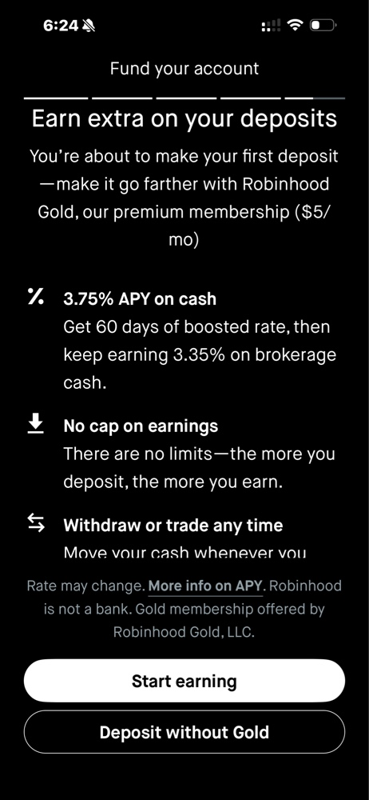

# 🏹 로빈후드(Robinhood) 가입 및 운영 가이드

로빈후드(Robinhood) 계좌 개설은 미국 거주자라면 앱을 통해 몇 분 만에 신청할 수 있을 정도로 간편합니다. 2026년 현재 기준으로 개설 요건과 단계를 정리해 드립니다.

---

## 1. 가입 전 필수 준비물

계좌를 개설하려면 다음의 조건과 서류가 필요합니다.

*   **연령**: 만 18세 이상
*   **신분**: 미국 시민권자, 영주권자 또는 유효한 미국 비자 보유자 (F1, H1B 등)
*   **사회보장번호 (SSN)**: 반드시 유효한 SSN이 있어야 합니다. (ITIN은 접수 불가)
*   **거주지**: 미국 50개 주 또는 푸에르토리코 내의 유효한 거주 주소
*   **은행 계좌**: 자금을 이체할 미국 은행 계좌 (Checking 또는 Savings)

---

## 2. 개설 단계

로빈후드는 웹사이트(robinhood.com)나 모바일 앱을 통해 가입할 수 있습니다.

1.  **앱 다운로드 및 시작**: App Store나 Google Play에서 'Robinhood' 앱을 설치하고 **[Sign Up]**을 클릭합니다.
2.  **개인 정보 입력**: 이름, 이메일, 생년월일, 미국 주소, 전화번호를 입력합니다.
3.  **SSN 입력**: 본인 인증 및 세무 보고를 위해 사회보장번호를 입력합니다. (미국 금융법에 따른 필수 사항입니다.)
4.  **투자 성향 설문**: 간단한 투자 경험 및 목적에 대한 질문에 답합니다.
5.  **은행 계좌 연결**: Plaid 등을 통해 본인의 은행 계좌를 즉시 연결하거나, 수동으로 계좌 번호(Account number)와 라우팅 번호(Routing number)를 입력합니다.
6.  **신분증 업로드 (필요 시)**: 시스템에서 자동으로 본인 확인이 되지 않을 경우, 운전면허증이나 비자 서류 사진을 찍어 업로드하라는 요청이 올 수 있습니다.
7.  **승인 대기**: 보통은 신청 즉시 승인되지만, 서류 검토가 필요한 경우 영업일 기준 1~5일 정도 소요될 수 있습니다.

---

## 3. 주의사항 및 팁

*   **입금 한도**: 계좌가 승인되면 즉시 거래할 수 있는 'Instant Deposit' 한도가 제공됩니다. (일반 계정 기준 보통 $1,000까지)
*   **비자 소지자의 경우**: 미국에 거주 중인 비자 소지자도 개설이 가능하지만, 향후 한국으로 영구 귀국하여 미국 거주자 신분을 상실하게 되면 계좌 유지나 거래에 제한이 생길 수 있으니 유의해야 합니다.
*   **프로모션 확인**: 가입 시 친구 초대 링크를 통해 가입하면 무료 주식(보통 $5~$200 사이의 가치)을 보너스로 받을 수 있으니 주변에 사용자가 있다면 링크를 요청해 보세요.

---

## 4. 로빈후드 골드(Robinhood Gold) 멤버십

로빈후드 골드(Robinhood Gold) 멤버십의 주요 혜택을 안내하고 있습니다. 월 5달러의 유료 서비스이며, 주요 혜택은 다음과 같습니다.

### 1) 예치금 이자 혜택 (APY)
*   **부스트 이율**: 첫 60일 동안은 **3.75% APY**의 높은 이자를 받을 수 있습니다.
*   **기본 이율**: 60일 이후에는 **3.35% APY**로 전환됩니다. (일반 계정의 0.01% 수준보다 훨씬 높습니다.)
*   **한도 없음**: 예치하는 금액이 많을수록 더 많은 이자를 받을 수 있으며 수익 한도가 없습니다.

### 2) 입출금 및 거래 자유도
*   **언제든 출금 가능**: 현금이 필요할 때 언제든지 인출하거나 주식 거래에 사용할 수 있습니다.
*   **즉시 입금 한도 상향**: 은행에서 입금할 때 즉시 거래에 사용할 수 있는 금액 한도가 일반 계정보다 높습니다. (이미지에는 생략되어 있으나 일반적인 골드 혜택)

### 3) 그 외 일반적인 골드 혜택 (이미지 외)
*   **IRA 매칭**: 은퇴 계좌(IRA) 입금 시 3% 매칭 혜택 (일반은 1%).
*   **마진 거래**: 첫 $1,000까지는 무이자로 마진(대출) 거래 가능.
*   **전문 데이터**: Nasdaq Level 2 데이터 및 Morningstar 리서치 보고서 제공.

> **요약하자면:**
> 현금을 투자하지 않고 계좌에만 넣어두어도 연 3.35% ~ 3.75%의 이자를 받을 수 있는 것이 가장 큰 장점입니다. 만약 계좌에 약 **$1,500~$1,800 이상의 유휴 현금**을 상시 보유하신다면, 발생하는 이자만으로도 월 $5의 멤버십 비용을 충분히 충당하고 수익을 낼 수 있습니다.
